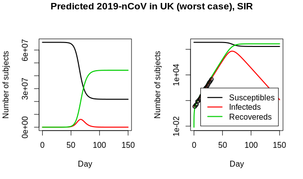
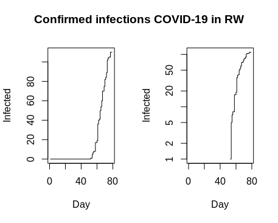

# COVID-19 Modeling with R, SIR epidemiologic model experiments
## (credit: tomwilding)

This models an SIR epidemic model using R, further details of the outputs can be found [here](https://tjwilding.wordpress.com/2020/03/20/epidemic-modelling-of-covid-19-in-the-uk-using-an-sir-model/)

COVID-19 current cumulative data from the <https://www.ecdc.europa.eu/en> 






### To install:

1. Install R
https://www.r-project.org/

2. Clone this repo and cd into it (```git clone https://github.com/tomwilding/covid-19Model-R.git```).

3. Start R from the command line in the root of this repo (Just type ```R``` at the command prompt)

4. Once R has started type ```source('sir.r')```

(Note you may also have to install the deSolve package using install.packages('deSolve'). Also note that you may need to run this command a couple of times for deSolve to install successfully.
